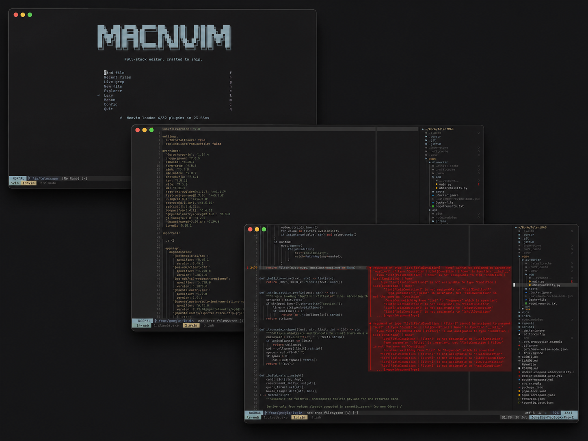

<div align="center">

# ⚡ Macnvim

**A fast, modern Neovim configuration for full-stack development.**

TypeScript · Python · Shell · Docker · Markdown

[](https://neovim.io)
[](https://www.lua.org)
[](#-whats-inside)
[](./LICENSE)



_Kanagawa Dragon theme · snacks dashboard · tiny-inline diagnostics · 32 plugins, ~24 ms to load_

[Install](#-install) · [What's inside](#-whats-inside) · [Keymaps](#-usage) · [Customize](#-customization)

</div>

---

## ✨ Why Macnvim

Most configs are either a 120-plugin distro you'll never fully understand, or a "minimal" setup missing everything you
need. Macnvim is the middle path: **32 plugins, each earning its place**, wired on native Neovim APIs so it stays fast
and won't rot.

- 🚀 **Native-first** — `vim.lsp.config` / `vim.lsp.enable` (no legacy lspconfig chains), nvim-treesitter main branch,
  native `gc` commenting, native treesitter folds
- ⚡ **Fast completion** — [blink.cmp](https://github.com/saghen/blink.cmp) + LuaSnip: LSP, snippets, path, buffer, and
  cmdline sources with a prebuilt fuzzy matcher
- 🎯 **Diagnostics that don't shout** —
  [tiny-inline-diagnostic](https://github.com/rachartier/tiny-inline-diagnostic.nvim) shows a boxed, wrapped message on
  the cursor line only; everywhere else, just gutter signs
- 🔭 **Picker-centric** — [fzf-lua](https://github.com/ibhagwan/fzf-lua) for files, grep, symbols, and diagnostics;
  [neo-tree](https://github.com/nvim-neo-tree/neo-tree.nvim) when you want a sidebar
- 🍬 **One UI toolkit** — [snacks.nvim](https://github.com/folke/snacks.nvim) powers the dashboard, notifications,
  terminals, LazyGit float, indent guides, big-file handling, and scratch buffers
- 🎨 **[Kanagawa](https://github.com/rebelot/kanagawa.nvim) Dragon** — warm, muted, easy on the eyes (matching tmux
  theme ships in the same palette)
- 💾 **Format on save** — conform.nvim (prettier / stylua / ruff / shfmt) at 120 columns, with **project configs always
  winning**; nvim-lint runs shellcheck, hadolint, markdownlint
- 📝 **Markdown that renders** — render-markdown.nvim styles headings, tables, and code blocks in the buffer
- 🧩 **Lazy-loaded** — nearly everything loads on demand; the dashboard reports single-digit plugin counts at startup

## 📸 Requirements

| Tool                                                             | Why                                    |
| ---------------------------------------------------------------- | -------------------------------------- |
| Neovim **0.11+** (0.12 recommended)                              | native LSP API, treesitter main branch |
| git, curl                                                        | plugin installs                        |
| [ripgrep](https://github.com/BurntSushi/ripgrep)                 | live grep, project search              |
| a [Nerd Font](https://www.nerdfonts.com/)                        | icons everywhere                       |
| Node.js + npm                                                    | TS/JS language servers                 |
| Python 3 + pip                                                   | pyright/ruff                           |
| make, tree-sitter CLI                                            | parser + native module builds          |
| [lazygit](https://github.com/jesseduffield/lazygit) _(optional)_ | `<leader>gg` git TUI                   |
| [fd](https://github.com/sharkdp/fd) _(optional)_                 | faster file finding                    |

macOS, one line:

```bash
brew install neovim ripgrep fd node python tree-sitter lazygit && \
brew install --cask font-jetbrains-mono-nerd-font
```

LSP servers, formatters, and linters install themselves through [Mason](https://github.com/williamboman/mason.nvim) on
first launch.

## 📦 Install

**1. Back up anything you have:**

```bash
mv ~/.config/nvim ~/.config/nvim.bak
mv ~/.local/share/nvim ~/.local/share/nvim.bak
```

**2. Clone and launch:**

```bash
git clone https://github.com/MuhammedZohaib/Macnvim.git ~/.config/nvim
nvim
```

lazy.nvim bootstraps itself, installs all plugins, and Mason pulls the language toolchain. Give the first launch a
minute, then restart.

**Or try it without touching your setup** (any Neovim 0.9+):

```bash
git clone https://github.com/MuhammedZohaib/Macnvim.git ~/.config/macnvim
NVIM_APPNAME=macnvim nvim
```

## 🗂 What's inside

```text
~/.config/nvim/
├── init.lua                 # entry point — loads core modules, bootstraps lazy.nvim
├── lua/core/
│   ├── options.lua          # editor settings (leader = Space)
│   ├── keymaps.lua          # global keybindings
│   ├── autocmds.lua         # autocommands (yank highlight, trim whitespace, ...)
│   └── lazy.lua             # plugin manager bootstrap
└── lua/plugins/             # one file per concern, auto-imported
    ├── colorscheme.lua      # kanagawa (dragon)
    ├── lsp.lua              # servers, diagnostics, Mason
    ├── completion.lua       # blink.cmp + LuaSnip
    ├── treesitter.lua       # parsers, textobjects, autotag
    ├── formatting.lua       # conform + nvim-lint
    ├── fzf.lua              # fzf-lua picker
    ├── neo-tree.lua         # file explorer
    ├── git.lua              # gitsigns
    ├── editing.lua          # surround, which-key, tmux navigation
    ├── ui.lua               # snacks (dashboard/terminal/lazygit/indent), lualine, noice
    ├── fullstack.lua        # typescript-tools
    └── markdown.lua         # render-markdown
```

**Languages out of the box:** TypeScript/JavaScript (typescript-tools + ESLint), Python (pyright + ruff), Lua, Bash,
HTML/CSS/Tailwind, JSON, YAML, Docker/Compose, Markdown. Open a filetype that needs a missing server and Mason offers a
one-key install (Go, Rust, C/C++, Svelte, Vue, Ruby, PHP, Zig, Terraform, Prisma, GraphQL, Elixir, Kotlin, and more).

## 🧭 Usage

Leader is **Space**. Press it and pause — which-key shows every binding. Searchable list: `<leader>fk`. Full reference:
**[usage.md](./usage.md)**.

The ten to learn first:

| Key                         | Action                       |
| --------------------------- | ---------------------------- |
| `<leader>ff` / `<leader>fg` | find files / grep project    |
| `<leader>e`                 | file explorer                |
| `gd` / `K`                  | definition / hover docs      |
| `<leader>ca` / `<leader>rn` | code action / rename         |
| `<leader>gg`                | LazyGit                      |
| `<leader>cf`                | format buffer                |
| `]d` `[d` / `]e` `[e`       | next/prev diagnostic / error |
| `<leader>fd`                | workspace diagnostics        |
| `<leader>xy`                | yank diagnostic to clipboard |
| `<leader>fk`                | search every keybinding      |

## 🎛 Customization

- **Editor behavior** → `lua/core/options.lua`
- **Add/remove plugins** → drop a spec file in `lua/plugins/`; lazy.nvim picks it up
- **Line length** → `colorcolumn`/`textwidth` in `options.lua`, formatter widths in `formatting.lua` (project configs
  always win)
- **Theme** → swap the spec in `lua/plugins/colorscheme.lua`

## 🩺 Troubleshooting

```vim
:checkhealth          " full health report
:Lazy                 " plugin states, sync, profile startup
:Mason                " language tool installs
:ConformInfo          " which formatter runs for this buffer
:checkhealth vim.lsp  " attached servers
```

Cold smoke test from a shell — expect empty output:

```bash
nvim --headless +qa 2>&1 | grep -iE "error|deprec|fail"
```

---

<div align="center">

If Macnvim saves you a config weekend, a ⭐ helps others find it.

</div>
